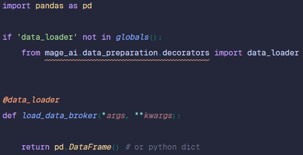

# Sedimark Mage AI Project Repository

Welcome to the Sedimark Mage AI project repository. This guide will help you contribute effectively to the project by following the structured process for creating and integrating pipeline blocks.

## Contributing to the Project

### Step 1: Download the Contribution Package
1. Download the **contribute.zip** archive from the repository.
2. The archive contains three Python files, each corresponding to a specific type of block:
   - **data_loader**
   - **transformer**
   - **data_exporter**

### Step 2: Structure Your Pipeline Code
- **Pipeline Design**: The pipeline should be divided into three types of blocks:
  - **Data Loader**: Responsible for loading the initial data.
  - **Transformers**: Used for transforming data. You can create multiple transformer blocks by duplicating the `transformer` Python file as needed.
  - **Data Exporter** (optional): Handles the export of data at the end of the pipeline.



- **Code Implementation**:
  - Place the main code inside the annotated function within each block.
  - You may create additional helper functions within the block to organize your code better.
  - The block's main output should typically be a pandas DataFrame, though returning a dictionary is also acceptable.

### Step 3: Document Your Blocks
1. After splitting your code into the appropriate blocks, open the `blocks.txt` file included in the archive.
2. Document your blocks by listing each Python file's name, followed by the block's name as it will appear in Mage. Each entry should be on a separate line, with the file name and block name separated by a comma.

### Step 4: Integrate with the Repository
1. Clone the repository to your local machine.
2. Navigate to the `imported_pipelines` folder and create a new directory with the name of your pipeline as it will be displayed in Mage.
3. Add all your Python files and the `blocks.txt` file to this new folder.

### Step 5: Managing Additional Code and Assets
- If your pipeline requires additional code or assets that are not directly utilized within the pipeline blocks, add them to the `utils` directory.
- To import these additional resources in your Python files, use the following import convention:
  ```python
  import default_repo.utils.<additional_code>
